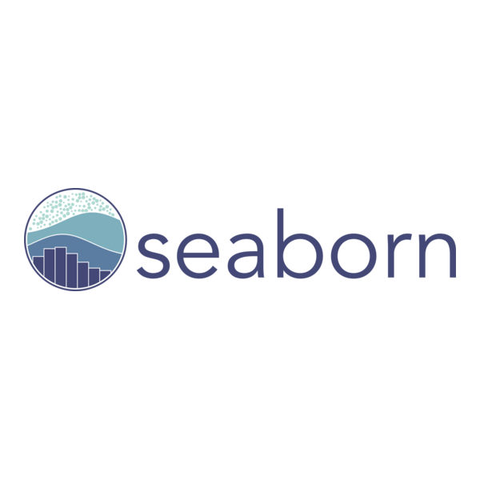
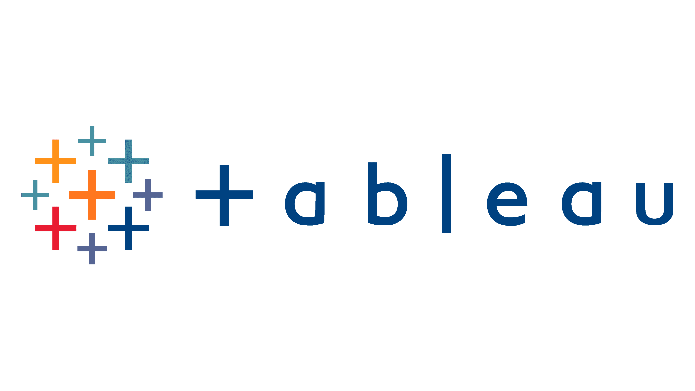

# Científico de datos

### **Acerca de mi**
Maestría en Electrónica y Comunicaciones con certificado y en transición a Data Scientist y experiencia en dirigir proyectos de nuevos productos.  Durante la certificación en Data Scientist, desarrolle múltiples proyectos para diferentes empresas enfocados en tomas de decisiones de negocio para nuevas estrategias, utilizando grandes volúmenes de datos y visualizaciones para mayor claridad. Dentro de las herramientas o técnicas utilizadas para dichos proyectos se encuentran Python, SQL, Big Data, Machine Learning y Data Wrangling. 

### **Herramientas**
 &nbsp;
 &nbsp;
 &nbsp;
 &nbsp;
 &nbsp;
 &nbsp;
 &nbsp;
 &nbsp;
 &nbsp;

### **Educación**
* **Científico de datos**, Tripleten bootcamp (2026)  
* **Electrónica y Comunicaciones**, Maestría en Tecnológico de Monterrey (2014)  
* **Electrónica y Comunicaciones**, Ingeniería en Tecnológico de Monterrey (2007)

### **Experiencia**

### **Proyectos**
